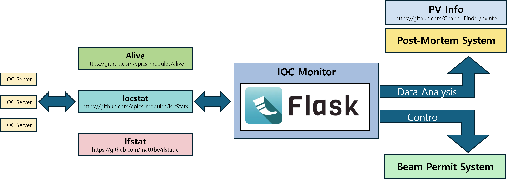

# EPICS IOC Monitor

**Webbased EPICS IOC Monitoring System**

EPICS Alive 기반의 IOC 모니터링/관리 웹 애플리케이션입니다. 오프라인 환경에서도 동작하도록 정적 자산(부트스트랩, xterm.js)을 로컬에 캐시합니다.

## 시스템 아키텍처



**IOC Monitor 시스템 구성도**

IOC Monitor는 다음과 같은 주요 컴포넌트로 구성됩니다:

- **Web Application**: Flask 기반 웹 인터페이스
- **Alive Server**: EPICS Alive 기반 IOC 모니터링 서버
- **PV Service**: EPICS PV 읽기/쓰기 및 자동 제어 서비스
- **WebSocket SSH**: 브라우저 기반 SSH 터미널 서비스
- **Log Service**: IOC 로그 및 시스템 로그 관리
- **MCP Client**: Model Context Protocol 클라이언트 예제

## 주요 기능

- **IOC 상태 모니터링**: 실시간 IOC 상태 확인
- **이벤트 로그**: IOC별 상세 로그 및 서버 로그
- **관리 기능**: IOC 마스크/언마스크, 삭제
- **WebSocket SSH**: 브라우저에서 직접 SSH 접속
- **환경 변수 표시**: IOC의 모든 환경 변수 확인
- **PV Control**: BPC 기반 자동 PV 제어 기능 (선택적)
- **API 문서**: 상세한 API 엔드포인트 문서 및 테스트 도구
- **MCP 클라이언트**: Model Context Protocol을 통한 외부 시스템 연동

## 설치 및 실행 (처음 설치 포함)

### 0. 사전 요구사항
- Linux (Ubuntu/Debian 권장), sudo 권한
- 인터넷 연결(최초 캐시 용도), 이후 오프라인 실행 가능
- 시스템 패키지: git, build-essential, gcc, make, curl 또는 wget, python3, python3-venv, python3-dev, libssl-dev, libffi-dev
- EPICS Base와 CA 툴(caget/caput)이 PATH에 존재 (없다면 caget/caput 관련 기능은 제한됨)

### 1. Alive 설치
```bash
./install_alive.sh
```

### 2. 개발 모드로 실행 (WebSocket SSH 포함)
```bash
./deploy_web_app.sh development
```

### 3. 프로덕션 모드로 실행 (WebSocket SSH 포함)
```bash
./deploy_web_app.sh production
```

### 4. WebSocket SSH 서버만 실행
```bash
./deploy_web_app.sh wssh
```

### 5. WebSocket SSH 서버 중지
```bash
./deploy_web_app.sh stop-wssh
```

## WebSocket SSH 기능 (브라우저 SSH)

WebSocket SSH를 사용하면 브라우저에서 직접 IOC에 SSH 접속할 수 있습니다.

### 자동 실행 / Auto-start
- **개발 모드**와 **프로덕션 모드**에서 WebSocket SSH 서버가 자동으로 백그라운드에서 시작됩니다.
- 별도 설정 없이 SSH 기능을 바로 사용할 수 있습니다.

### 수동 실행:
WebSocket SSH 서버만 별도로 실행하려면:
```bash
./deploy_web_app.sh wssh
```

### 사용 방법 / How to use
1. IOC Monitor 웹 페이지에서 로그인 후 SSH 버튼 클릭
2. 로그인 창에서 계정 입력 후 연결하면 브라우저 내 xterm 기반 터미널이 열립니다.

### SSH 서버 중지:
```bash
./deploy_web_app.sh stop-wssh
```

## 관리자 계정 / Admin Credentials

- **초기 계정**: `raon` / `raon`
- 로그인 후 SSH, 마스크, 삭제 기능 사용 가능

## 포트 정보 / Ports

- **웹 서버**: 5001
- **WebSocket SSH**: 8022

## 파일 구조 / File Layout

```
IOC_Monitor/
├── web-app/                 # Flask 웹 애플리케이션
├── venv/                   # Python 가상환경
├── logs/                   # 로그 파일들
├── deploy_web_app.sh       # 배포 스크립트
├── start_wssh.sh          # WebSocket SSH 서버 스크립트
└── README.md              # 이 파일

## 오프라인 자산 / Offline Assets
- 배포 스크립트가 최초 실행 시 다음 자산을 `web-app/static/vendor` 경로에 다운로드/캐시합니다.
  - Bootstrap 5.3.0 (CSS/JS)
  - xterm.js 5.3.0, xterm-addon-fit 0.8.0 (CSS/JS)
- 이후 템플릿은 CDN 대신 로컬 자산을 참조하므로 인터넷 없이도 UI가 정상 동작합니다.

## PV Control 기능 (선택적)

### 개요
BPC(Beam Position Control) 값과 IOC 상태를 기반으로 자동으로 EPICS PV를 제어하는 기능입니다.

### 활성화 방법
환경 변수를 설정하여 PV Control 기능을 활성화할 수 있습니다:

```bash
export IOC_MONITOR_PV_CONTROL_ENABLED=true
```

또는 `.env` 파일에 추가:
```
IOC_MONITOR_PV_CONTROL_ENABLED=true
```

### 설정 가능한 PV들

#### 1. 임계값 PV (Threshold PV)
- **기본값**: `TEST-CTRL:SYS-MACHINE:MODE`
- **설정 방법**: 환경 변수 `IOC_MONITOR_THRESHOLD_PV`로 변경 가능
- **용도**: BPC 비교를 위한 임계값을 실시간으로 제공

#### 2. 제어 PV (Control PV)
- **기본값**: `TEST-CTRL:SYS-IOCM:READY`
- **설정 방법**: 환경 변수 `IOC_MONITOR_CONTROL_PV`로 변경 가능
- **용도**: IOC Monitor Ready 상태를 나타내는 제어 신호

### 설정 방법

#### 방법 1: config.env 파일 사용 (권장)
프로젝트 루트의 `config.env` 파일에서 설정:

```bash
# config.env 파일에 추가
# PV Control Feature Configuration
export IOC_MONITOR_PV_CONTROL_ENABLED=true
export IOC_MONITOR_THRESHOLD_PV=MY-SYS:MACHINE:MODE
export IOC_MONITOR_CONTROL_PV=MY-SYS:IOCM:READY
```

설정 후 웹 앱을 재시작하면 자동으로 적용됩니다.

#### 방법 2: .env 파일 사용
프로젝트 루트에 `.env` 파일을 생성하고 다음 내용을 추가:

```bash
# .env 파일
IOC_MONITOR_PV_CONTROL_ENABLED=true
IOC_MONITOR_THRESHOLD_PV=MY-SYS:MACHINE:MODE
IOC_MONITOR_CONTROL_PV=MY-SYS:IOCM:READY
```

#### 방법 3: 시스템 환경 변수 설정
```bash
# 현재 세션에만 적용
export IOC_MONITOR_PV_CONTROL_ENABLED=true
export IOC_MONITOR_THRESHOLD_PV=MY-SYS:MACHINE:MODE
export IOC_MONITOR_CONTROL_PV=MY-SYS:IOCM:READY

# 영구 설정 (bashrc에 추가)
echo 'export IOC_MONITOR_PV_CONTROL_ENABLED=true' >> ~/.bashrc
echo 'export IOC_MONITOR_THRESHOLD_PV=MY-SYS:MACHINE:MODE' >> ~/.bashrc
echo 'export IOC_MONITOR_CONTROL_PV=MY-SYS:IOCM:READY' >> ~/.bashrc
source ~/.bashrc
```

#### 방법 4: 실행 시 직접 설정
```bash
IOC_MONITOR_PV_CONTROL_ENABLED=true ./deploy_web_app.sh development
```

### 동작 원리
1. **임계값 모니터링**: 설정된 임계값 PV에서 실시간으로 임계값을 읽어옴
2. **IOC 상태 확인**: 모든 IOC의 BPC 값과 상태를 1초마다 확인
3. **제어 로직**: 
   - 꺼진 IOC 중 BPC ≥ 임계값인 것이 있으면 → 제어 PV를 0 (NOT READY)
   - 모든 IOC가 정상이거나 BPC < 임계값인 꺼진 IOC만 있으면 → 제어 PV를 1 (READY)
4. **BPC 값 파싱**: 16진수(0x00), 10진수(1), 2진수(0b1) 등 다양한 형식 지원

### API 엔드포인트
- `GET /api/pv/caget/<pvname>`: PV 값 읽기
- `POST /api/pv/caput/<pvname>`: PV 값 설정
- `GET /api/ioc_monitor_ready/status`: PV Control 상태 확인

### 웹 UI 표시
PV Control 기능이 활성화되면 웹 대시보드에 "IOC Monitor Ready Status" 섹션이 표시됩니다.

## API 문서 및 테스트

### API 문서 페이지
웹 애플리케이션에서 `/api/docs` 경로로 접근하여 모든 API 엔드포인트의 상세한 문서를 확인할 수 있습니다.

### API 테스트 도구
- **test_api.py**: API 엔드포인트 테스트를 위한 Python 스크립트
- **API_README.md**: API 사용법 및 예제 코드 상세 문서

### 주요 API 엔드포인트
- **시스템 상태**: `/api/status`, `/api/ioc_count`
- **IOC 정보**: `/api/alive/ioc_list`, `/api/alive/ioc_details`
- **PV 제어**: `/api/pv/caget/<pvname>`, `/api/pv/caput/<pvname>`
- **로그 관리**: `/api/ioc_logs/<iocname>`, `/api/events`
- **관리 기능**: `/api/delete`, `/api/toggle_mask`

### MCP 클라이언트 예제
`mcp_client_example.py`를 통해 Model Context Protocol을 사용한 외부 시스템과의 연동 예제를 제공합니다.

## 주의사항 / Notes
- EPICS Base/CA 툴이 없으면 일부 기능(caget/caput)이 제한됩니다.
- 방화벽에서 5001(웹), 8022(WebSocket SSH) 포트를 허용하세요.
- PV Control 기능은 선택적이며, 활성화하지 않아도 기본 IOC 모니터링 기능은 정상 동작합니다.
``` 